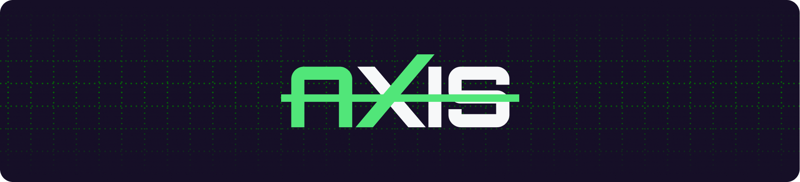

  

  <h4 align="center">
  The new axis of CSS.
</h4>

## About

**AxisUI** is a modern utility-first CSS framework designed to simplify the process of building responsive, scalable, and maintainable user interfaces.

The idea behind AxisUI was born from real-world development experience. While existing frameworks provide powerful solutions, many developers still encounter limitations in flexibility, consistency, or workflow efficiency. AxisUI aims to address these gaps by combining the strengths of modern utility-based styling with a structured, developer-friendly architecture.

Our goal is to create a framework that allows developers to design responsive interfaces quickly without unnecessary complexity, repetitive configuration, or excessive custom media queries. AxisUI focuses on clarity, performance, and consistency — enabling teams and individuals to build interfaces with confidence.

AxisUI is built with a long-term vision: to establish a new standard in the CSS framework ecosystem by prioritizing usability, extensibility, and modern development practices.

We believe great tools should feel intuitive, predictable, and efficient. AxisUI is designed to be one of those tools.

---

> [!NOTE]
> **Current Status:**
> AxisUI is currently under active development.

---

## License

This project is licensed under the **MIT License**.

You are free to use, modify, and distribute this software in personal or commercial projects.  

---

## Maintained By

**AxisUI Team:**  
Open-source CSS framework focused on modern web development.
